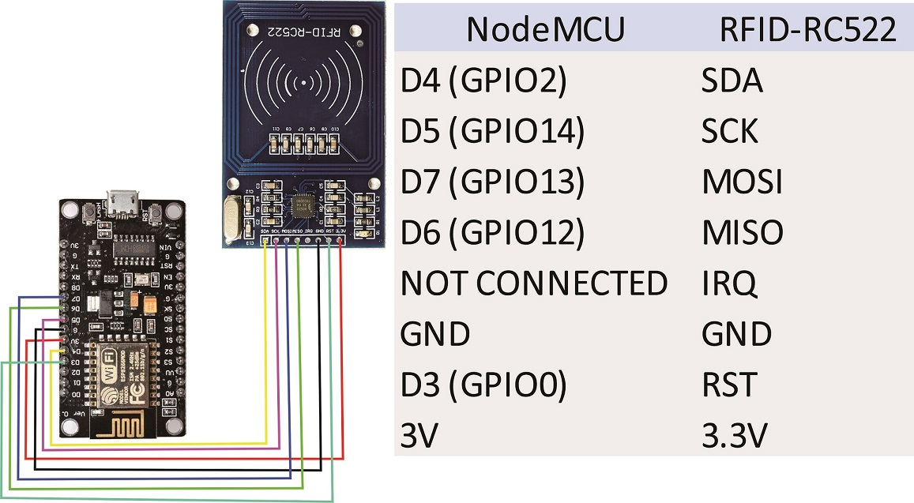

# RFID_CARD_Arduino
This project is about rfid cards using rfid card reader and NodeMCU to read the card number and also to detect particular card.
# components used
NodeMCU,
RC522 RFID reader,
Jumper wires,
A buzzer,
Bread board. 

# About
This project contians two ino files in which one of the file is just to identify the card tag and to print it on the serial monitor and the other is to give a buzzer three times when selected card detected and a long buzzer when other than selected card detected.
# Applications
Access control,
Race timing,
Inventory tracking,
Attendence etc..
